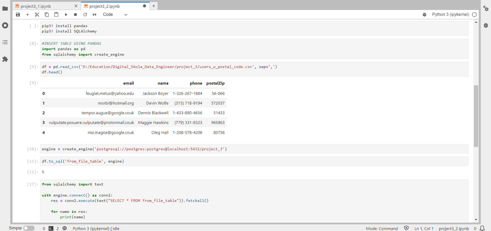
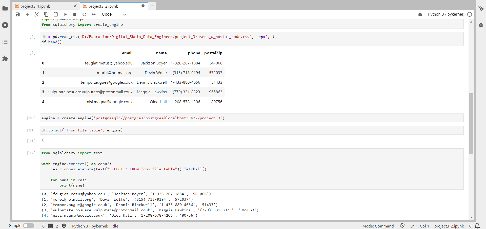

#Project 3 - Batch Processing

##Context
Using Python packages (pandas, SQLAlchemy, psycopg2) to configure your csv files from the local into table in PostgreSQL

##Environment
Jupyter Notebook & Anaconda

##Expected Result

